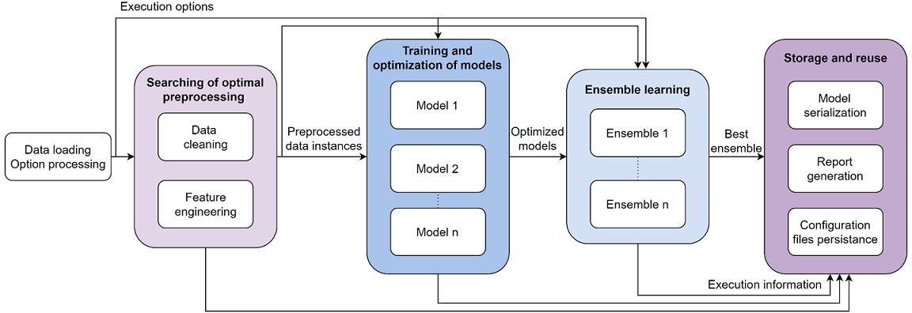

### Fully automated machine learning system that solves any classification or regression problem that is stored in a tabular format

This represents the backend of Odin AI, a web platform that optimizes products and business processes by automatically generating in a few minutes, artificial intelligence-based solutions that solve data prediction problems stored in tabular format. Django was used as the web framework for embedding the tool and creating the API. The application was hosted on Azure by using the App Service.

## Features

- Advanced data cleaning and complete feature engineering
- Search for optimally preprocessed data instances for each model
- Training of various models
- Bayesian optimization
- Stacking ensemble
- Easy-to-reuse models
- Reports that explain the created solution
- Operable without programming knowledge

## Diagram

## Performance

The results shown below were obtained after running the systems for only 30 minutes. For more information please refer to [this](https://gitlab.com/BindilaMihai/automl_tool#performance).

- Outperforms at least one similar tool in 50% of benchmarks
- Achieves an average top position of 43.47% in profile competitions against humans

## Appendix

- A complete presentation, a copy of the research paper, and more details can be found in the [original repository](https://gitlab.com/BindilaMihai/automl_tool).
- You can access the Odin AI web platform [here](https://odin-ai.net/#/).

## License

[GNU GPLv3](https://choosealicense.com/licenses/gpl-3.0/)
